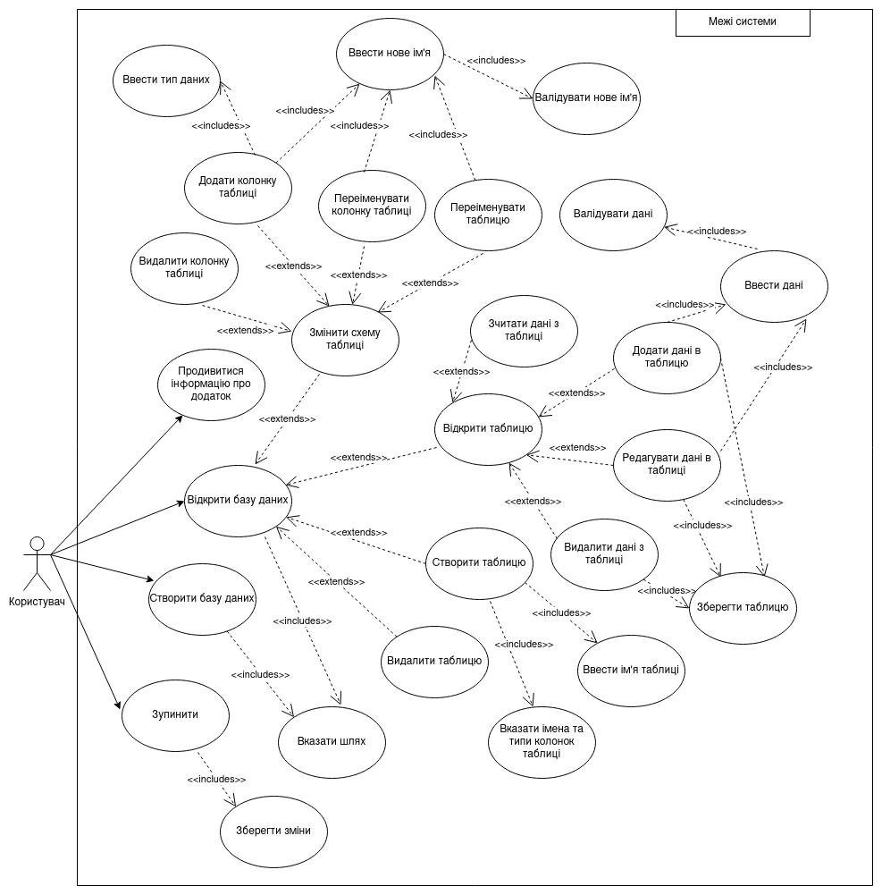
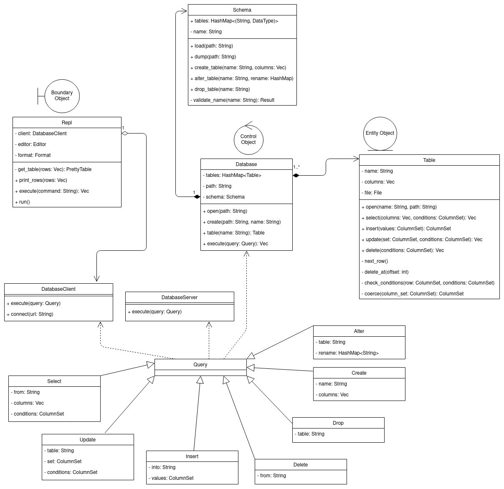

# `dobby`


[](https://deps.rs/repo/github/ly0va/dobby)

*A database engine as poor as a house elf*

> Disclaimer: this is a university project. Please don't jump to any conclusions when you see
> poorly designed, poorly tested, feature-deprived, underdocumented and/or buggy modules.
> This is not meant for public use. For educational purposes only.

## About

`dobby` is a homemade table-oriented (but not really relational) database engine with a modular design.

## Features

- :floppy_disk: Basic CRUD operations
- :gear: Filtering based on column values
- :hammer_and_wrench: Creating and dropping tables
- :pencil: Renaming columns
- :envelope: A modern REST API
- :package: An even more modern gRPC API
- :sparkles: A fancy CLI client
- :rocket: Try `dobby` on [Heroku](http://dobby.lyova.xyz)!
- :computer: Cross-platform!
- :zap: Blazingly fast

You can read about each module in the [docs](./docs).

## Installation

```bash
cargo install --bins --git https://github.com/ly0va/dobby
```

## Use-case diagram



## Class diagram


