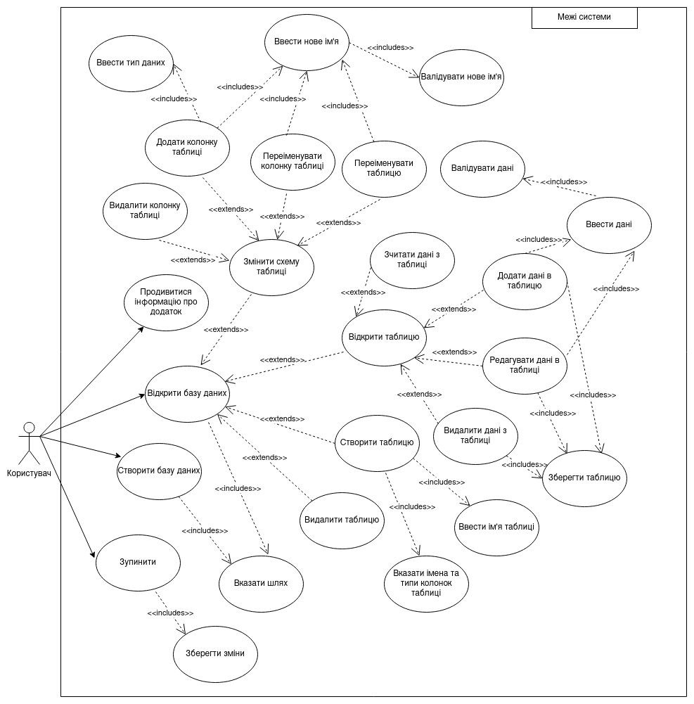

# Architechture

The design of `dobby` is modular:

- `Database` object acts as a black box with only `execute` method exposed
- Each API service is defined in a separate module and only interacts with the database via this method
- Each API service is pluggable, meaning `dobby` can run all or some of the services - as needed.
- `Database` has swappable back-ends (e.g. using `sqlite` instead of `dobby`'s engine is possible)

## Use-case diagram

## Class diagram

> **note**: this doesn't really make sense, since Rust is not an OOP language,
> but the university course I'm doing this for doesn't really care.
