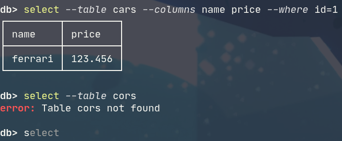

# `dobby` CLI client

This is the `dobby` CLI client that supports most of the `dobby` features (there aren't many).
It uses the gRPC API to communicate with the server.

## Features

- Configurable output format (`ascii`/`json`/`csv`/`html`)
- Command hinting, highlighting and autocompletion
- History navigation
- Pretty unicode tables

## Usage

```
USAGE:
    dobby [OPTIONS] --url <url>

FLAGS:
    -h, --help       Prints help information
    -V, --version    Prints version information

OPTIONS:
    -f, --format <format>    The output format [default: ascii]  [possible values: ascii, json, csv, html]
    -u, --url <url>          URL of the dobby server [env: DOBBY_URL]
```

To start the client, provide a gRPC server URL - either via the `--url` option or via `$DOBBY_URL` env variable:

```
dobby -u http://dobby.lyova.xyz
```

## The REPL

The `dobby` REPL accepts 8 commands:

```
SUBCOMMANDS:
    create    Create a new table
    delete    Delete rows from the table
    drop      Drop the whole table
    help      Prints this message or the help of the given subcommand(s)
    insert    Insert a row into the table
    rename    Rename columns in the table
    select    Read rows from the table
    update    Update rows in the table
```

You can see details about each command via `help <command>` or `<command> --help`. Here is the `select` command, for example:

```
Read rows from the table

USAGE:
    select [OPTIONS] --table <table>

FLAGS:
    -h, --help    Prints help information

OPTIONS:
    -c, --columns <columns>...     The columns to read (table projection)
    -w, --where <conditions>...    The filter to apply to the rows, in the form of column=value
    -t, --table <table>            The table to read from
```

## Example queries

```
db> create --table cars --columns id=int name=string price=float

db> insert --table cars --values id=1 name=ferrari price=123.456

db> select --table cars --columns name price --where id=1
┌─────────┬─────────┐
│ name    │ price   │
├─────────┼─────────┤
│ ferrari │ 123.456 │
└─────────┴─────────┘
```

## Screenshot


