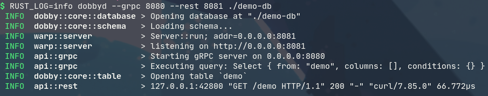

# `dobby` server

This is the `dobby` back-end, it processes queries and manages data storage.

## Usage

```
USAGE:
    dobbyd [OPTIONS] <path>

FLAGS:
    -h, --help       Prints help information
        --sqlite     Use sqlite as the backend
    -V, --version    Prints version information

OPTIONS:
        --grpc <grpc-port>    Run gRPC server on <port>
        --new <name>          Creates a new database called <name>
        --rest <rest-port>    Run REST server on <port>

ARGS:
    <path>    Path to the database directory
```

Example usage that will run gRPC API on port 8080, serving a database at `./demo-db`:

**Native**: `dobbyd --grpc 8080 ./demo-db`

**Dockerized**: `docker run -v $PWD/demo-db:/demo-db -p 8080:8080 dobby:master dobbyd --grpc 8080 ./demo-db`

To enable logging, set `$RUST_LOG` env variable to one of `error`/`warn`/`info`/`debug`/`trace`.

## Screenshot




